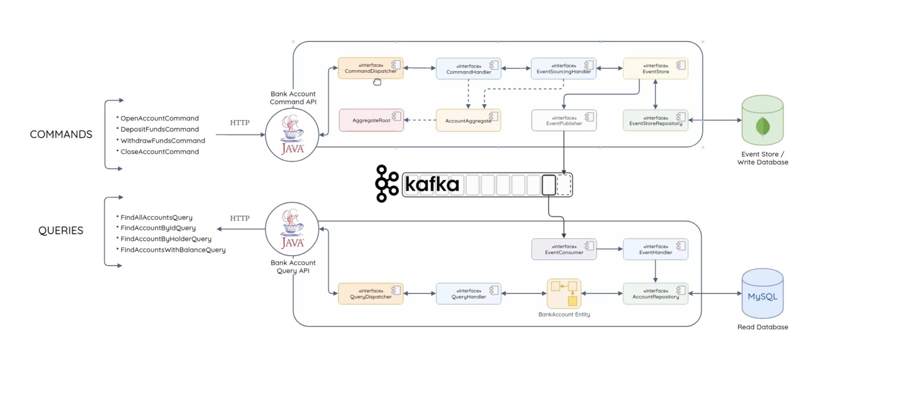

# BANK API TO CREATE ACCOUNTS AND TRANSFER MONEY

___
throughout this project, I leaned how to use the two architectural patterns

## CQRS: 
Command Query Responsibility Segregation, is an architectural pattern
that separates the read and write operations of a system. Instead of 
using a single model to handle both commands that modify data and queries
that retrieve data , CQRS employs separate models for each .

## Event Sourcing:
Event sourcing is an architectural pattern that stores all changes to an
application state as a sequence of events. Event sourcing persists the
state of a business entity such an account as a sequence of state-changing
events. Whenever the state of a business entity changes, a new event is
appended to the list of events. Since saving an event is a single operation,
it is inherently atomic. The application reconstructs an entity’s current
state by replaying the events .

what I learned from this project :
- how to implement a command and query bus using the mediator pattern
- how to implement an event store to store events
- how to reconstruct an entity state from a sequence of events
- how to project events to update the read model